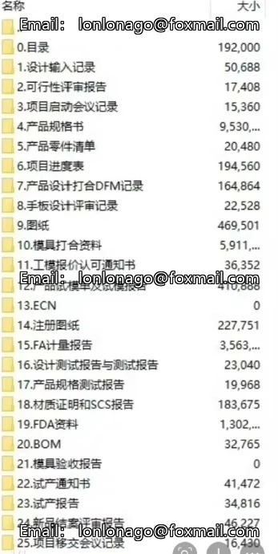

# Product Development Process Template SOP (Standard Operating Procedure)

## Body

Product Development Process Template SOP, essential documentation for Product Structure Senior Engineers!
Product Development Process Template SOP, essential documentation for Product Structure Senior Engineers!
Product Development Process Template SOP, essential documentation for Product Structure Senior Engineers!

Product Development Process Template SOP, Essential Documentation for Advanced Product Structure Engineers!

The complete product development process documentation, including design input, feasibility review, project kickoff meeting records, product specifications, part lists, schedules, DFM records, design review records, drawings, mold information, trial mold reports, ECN, and injection.

Complete set of documents including drawings, FA measurement reports, design test reports, product specification testing reports, FDA documentation, BOM, mold acceptance reports, trial production notices, trial production reports, closure review reports, and project handover records.

Send through Baidu NetEase Cloud, and the goods will be dispatched immediately after payment confirmation. No returns or exchanges for virtual products.

## Images

## Payment

Here is a pay link on Stripe ( https://buy.stripe.com/3cs8yP7sY87d0vu9AB ). Please contact me lonlonago@foxmail.com after funding $89, and I will send you a complete data files , thank you!

